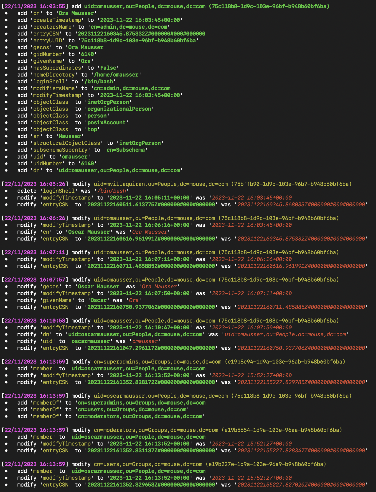
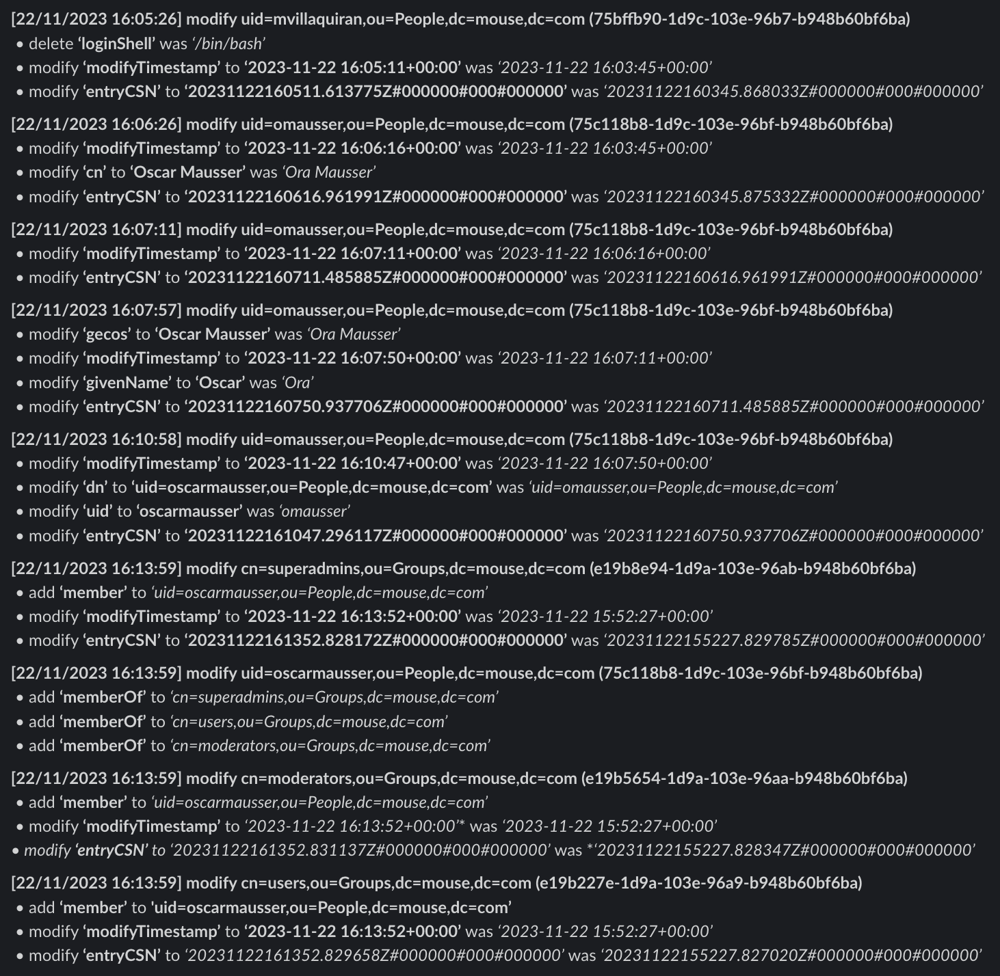

# LDAP Stalker

## Overview
LDAP Stalker is a tool designed to monitor changes in an LDAP directory in real-time. It provides a mechanism to track and visualize modifications, additions, and removals to user and group entries, allowing users to correlate expected changes with actual changes and identify potential security incidents. It was created with OpenLDAP in mind, however it may work in other implementations of LDAP. It is written in Python3 and only requires the ldap3 library.

In addition to monitoring for modifications, additions, and removals in an LDAP directory, it can be configured to ignore specific attributes, or even fine-tuned to ignore fine-grained attributes depending on their old/new values.

The changes that are monitored can either be forwarded to a slack webhook or output to the terminal (or both). Optional colored output is also supported.

## Features

1.  **Real-time Monitoring:** LDAP Stalker continuously monitors an LDAP directory for changes in user and group entries.

2.  **Change Comparison:** The tool compares changes between consecutive LDAP searches, highlighting additions, modifications, and deletions.

3.  **Control User Verification:** LDAP Stalker supports a control user mechanism, triggering an error if the control user's changes are not found.

4.  **Flexible LDAP Filtering:** Users can customize LDAP filtering using the `SEARCH_FILTER` parameter to focus on specific object classes or attributes.

5.  **Slack Integration:** Receive real-time notifications on Slack for added, modified, or deleted LDAP entries.

6.  **Customizable Output:** Console output provides clear and colored indications of additions, modifications, and deletions for easy visibility.

7.  **Ignored Entries and Attributes:** Users can specify UUIDs and attributes to be ignored during the comparison process.

8.  **Conditional Ignored Attributes:** Conditional filtering allows users to ignore specific attributes based on change type (additions, modifications, deletions).


## Examples (No Filtering)






In the above examples, entryCSN and modifyTimestamp can be completely ignored by setting `IGNORED_ATTRIBUTES = ['entryCSN', 'modifyTimestamp']`.


## Requirements
- Python 3.x
- The `ldap3` and `requests` libraries (`pip install ldap3 requests`).
- Slack Webhook URL for notifications (optional).

## Configuration

### General Settings
- `CONTROL_UUID`: UUID of a control user whose changes trigger an error if not found. If set, this user should always have some type of change when the LDAP directory is retrieved. At least one attribute must have changed.
- `CONTROL_USER_ATTRIBUTE`: Specify a specific attribute to check for changes in the control user. If set, this attribute _must_ have changed for the _CONTROL_UUID_ user.
- `LDAP_SERVER`: LDAP server URL.
- `BASE_DN`: The base Distinguished Name for LDAP searches.
- `SEARCH_FILTER`: LDAP filter for user and group entries.
- `SEARCH_ATTRIBUTE`: List of attributes to retrieve during the LDAP search. [['*' '+']](https://joshua.hu/tracking-secret-ldap-login-times-with-modifytimestamp-heuristics) is used by default to include operational attributes.
- `REFRESH_RATE`: Time interval (in seconds) between consecutive LDAP searches.
- `LDAP_USERNAME`: LDAP username for authentication. Leave empty for anonymous bind.
- `LDAP_PASSWORD`: LDAP password for authentication. Leave empty for anonymous bind.
- `USE_SSL`: Set to `True` to use SSL, `False` otherwise.
- `DISABLE_COLOR_OUTPUT`: Set to `True` to disable color output.

### Slack Integration
- `SLACK_BULLETPOINT`: Bullet point used in Slack and console output.
- `SLACK_WEBHOOK`: Set the Slack Webhook URL as an environment variable.

### Ignored Entries and Attributes
- `IGNORED_UUIDS`: List of UUIDs to be ignored during comparison.
- `IGNORED_ATTRIBUTES`: List of attributes to be ignored during comparison.

### Conditional Ignored Attributes
- `CONDITIONAL_IGNORED_ATTRIBUTES`: Dictionary with attributes as keys and lists of values to ignore based on change type.

## Example Configuration

```
CONTROL_UUID = 'a71c6e4c-8881-4a03-95bf-4fc25d5e6359' # The entryUUID of an entry in the directory which must always have some type of modification.
CONTROL_USER_ATTRIBUTE = '' # Specifically, if this is set, this is the attribute that must have changed.

LDAP_SERVER = 'ldaps://ldaps.intra.lan' # The LDAP(S) server.
BASE_DN = 'dc=mouse,dc=com' # The basename used by the directory.
SEARCH_FILTER = '(&(|(objectClass=inetOrgPerson)(objectClass=groupOfNames)))'
SEARCH_ATTRIBUTE = ['*', '+']  # replace with the attributes you want to retrieve

REFRESH_RATE = 60 # Refresh the directory every 60 seconds.

LDAP_USERNAME = 'Emily'
LDAP_PASSWORD = 'qwerty123'
USE_SSL = True

DISABLE_COLOR_OUTPUT = False
SLACK_BULLETPOINT = ' \u2022   ' # Prepend this to each change if sending notifications via Slack.

IGNORED_UUIDS = ['e191c564-6e6d-42c1-ae51-bda0509fe846', '8655e0d9-ecdc-46ce-ba42-1fa3dfbf5faa'] # Ignore any changes users with these UUIDs.
IGNORED_ATTRIBUTES = ['modifyTimestamp', 'phoneNumber', 'officeLocation', 'gecos'] # Ignore any modifications of these attributes. 

CONDITIONAL_IGNORED_ATTRIBUTES = {
  'objectClass': ['posixAccount'], # Ignore changes to the objectClass attribute if the new or old value is posixAccount.
  'memberOf': ['cn=mailing-list-user,ou=Accessgroups,dc=mouse,dc=com', 'cn=interns,ou=Accessgroups,dc=mouse,dc=com'], # Ignore changes to the memberOf attribute if the new or old value is either "cn=mailing-list-user,ou=Accessgroups,dc=mouse,dc=com" or "cn=interns,ou=Accessgroups,dc=mouse,dc=com".
  'organizationalStatus': ['researcher'], # Ignore changes to the organizationalStatus attribute if the new or old value is 'researcher'.
}

SLACK_WEBHOOK = os.getenv('SLACK_WEBHOOK_URL') # Use a Slack webhook, and retrieve it from the environmental value.
```


## Usage
1. Set the required configuration in the script.
2. Run the script using `python3 ldap-stalker.py`.

The script will continuously monitor the LDAP directory, compare changes, and report them to both the console and Slack.

**Note:** Ensure that the necessary libraries are installed (`ldap3`, `requests`) and that you have the required permissions to access the LDAP server.

## Installation
In addition to running the script manually, a small debian-based installation script [install.sh](install.sh) is provided which when run as root, will install a systemd service to run the script in the background and log the output. The script is installed as /usr/local/bin/ldap-diff.py, logs are sent to /var/log/ldap-diff.log, and a logrotate configuration file is created in /etc/logrotate.d/ldap-diff.

An optional first parameter of the installation script can define the _SLACK_WEBHOOK_URL_ environmental variable:

```
$ ./install.sh "https://hooks.slack.com/services/[...]"
ldap-stalker has been installed, the service is started, and log rotation is set up.
```


## Limitations
1. The _CONDITIONAL_IGNORED_ATTRIBUTES_ configuration may unfortunately hide important changes that are not intended to be hidden. This may happen if an attribute has a single value which is changed. This is because _CONDITIONAL_IGNORED_ATTRIBUTES_ will hide changes to the attribute both when the value is changed __to__ _as well as_ __from__ the ignored value; for example, if a user is a memberOf _cn=mailing-list-user,ou=Accessgroups,dc=mouse,dc=com_ which gets __changed__ to _cn=super-administrator,ou=Accessgroups,dc=mouse,dc=com_, it will be missed.
2. Similar to #1, there is no real way to determine whether a change is really a change in some cases, or a removal and then addition in the same time. In theory, it doesn't really matter, however it's important to note.


## License
This project is licensed under [GPL3.0](/LICENSE).
