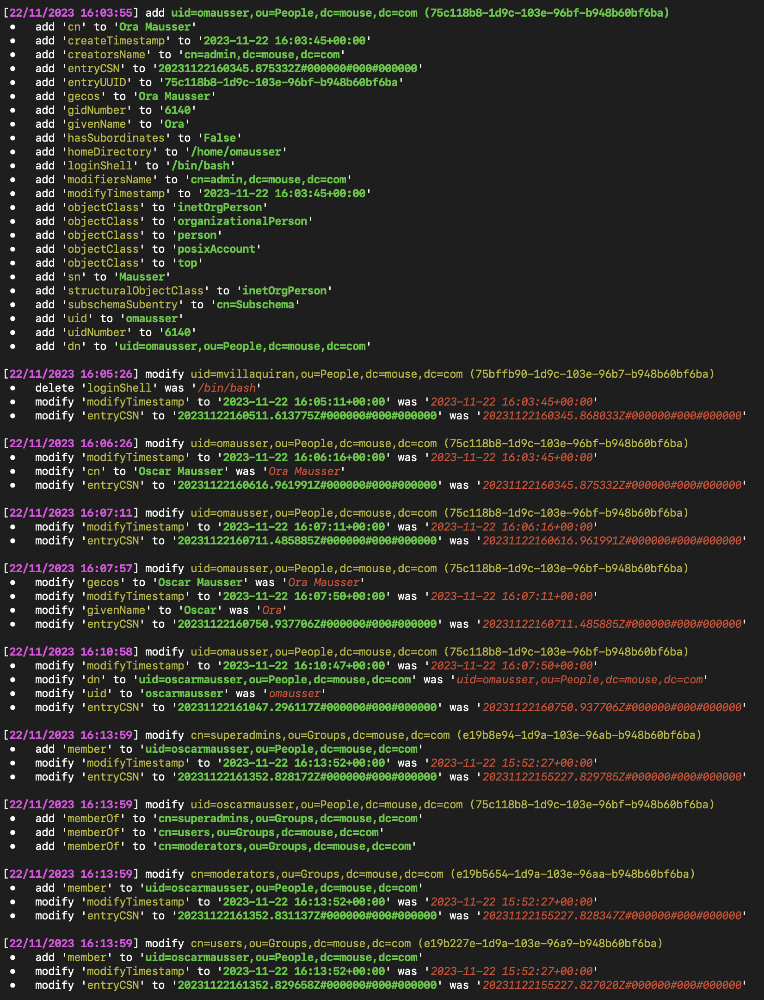
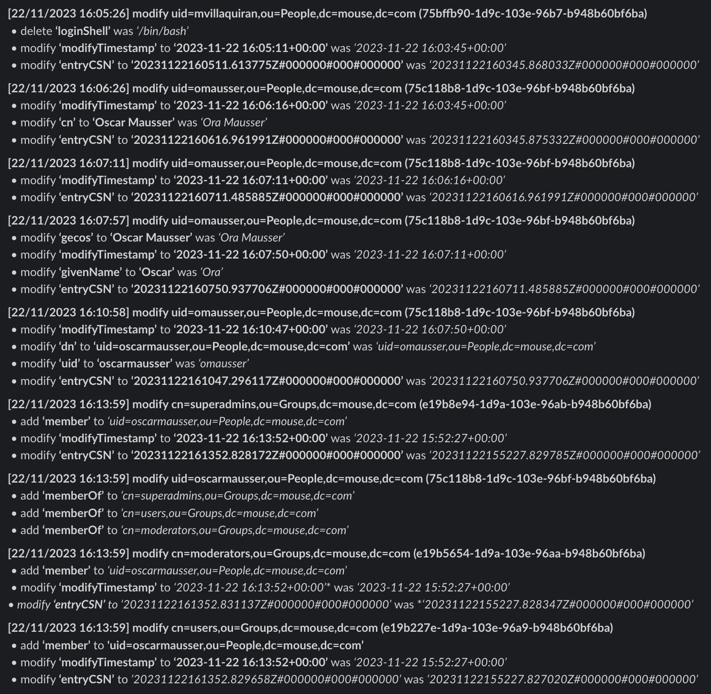

# LDAP Watchdog

[](https://pypi.org/project/LDAP-Monitor/)
[](https://hub.docker.com/r/megamansec/ldap-monitor)

## Overview
LDAP Watchdog is a tool designed to monitor record changes in an LDAP directory in real-time.
It provides a mechanism to track and visualize modifications, additions, and removals to user and group entries, allowing users to correlate expected changes with actual changes and identify potential security incidents.
It was created with OpenLDAP and Linux in mind, however it may work in other implementations of LDAP.
It is written in Python and only requires the ldap3 library.

This software was written by [Joshua Rogers](https://joshua.hu/).

If you're interesting in any of the following, then LDAP Watchdog is for you:
- Know what's going on in your LDAP directory on-demand with Slack webhook integration.
- See new hires, leavers, and promotions as they appear in LDAP.
- Monitor _when_ and what HR is doing.
- Detect unauthorized changes in LDAP.
- Monitor for accidentally leaked data.
- Detect when users are logging in and out of LDAP.

In addition to monitoring for modifications, additions, and removals in an LDAP directory, it can be configured to ignore specific attributes, or even fine-tuned to ignore fine-grained attributes depending on their old/new values.

The changes that are monitored can either be forwarded to a slack webhook or output to the terminal (or both). Optional colored output is also supported.

Previously named LDAP-Stalker (because monitoring changes of an LDAP directory is an excellent way to stalk changes in a company: learn about promotions before they're announced, new hires, leavers, etc.), a blog post about the details and history of this project [can be found here](https://joshua.hu/ldap-watchdog-openldap-python-monitoring-tool-realtime-directory-slack-notifications).

## Examples (No Filtering)

Note: in the below examples, entryCSN and modifyTimestamp can be completely ignored by setting `LDAP_WATCHDOG_IGNORED_ATTRIBUTES=entryCSN,modifyTimestamp`.

### Terminal (with color) output:



### Slack output:



## Features

1.  **Real-time Monitoring:** LDAP Watchdog continuously monitors an LDAP directory for changes in user and group entries.

2.  **Change Comparison:** The tool compares changes between consecutive LDAP searches, highlighting additions, modifications, and deletions.

3.  **Control User Verification:** LDAP Watchdog supports a control user mechanism, triggering an error if the control user's changes are not found.

4.  **Flexible LDAP Filtering:** Users can customize LDAP filtering using the `LDAP_WATCHDOG_SEARCH_FILTER` environment variable to focus on specific object classes or attributes.

5.  **Slack Integration:** Receive real-time notifications on Slack for added, modified, or deleted LDAP entries.

6.  **Customizable Output:** Console output provides clear and colored indications of additions, modifications, and deletions for easy visibility.

7.  **Ignored Entries and Attributes:** Users can specify UUIDs and attributes to be ignored during the comparison process.

8.  **Conditional Ignored Attributes:** Conditional filtering allows users to ignore specific attributes based on change type (additions, modifications, deletions).


## Requirements
- Python 3.7+.
- The `ldap3` package. If using a Slack webhook, the `requests` package is also required.

## Installation

### PyPI

```bash
pip install LDAP-Monitor
```

To include Slack webhook support:

```bash
pip install LDAP-Monitor[slack]
```

### Docker

```bash
docker pull megamansec/ldap-monitor
```

Or from GitHub Container Registry:

```bash
docker pull ghcr.io/megamansec/ldap-monitoring-watchdog
```

### From Source

```bash
git clone https://github.com/MegaManSec/LDAP-Monitoring-Watchdog.git
cd LDAP-Monitoring-Watchdog
pip install ".[slack]"
```

## Usage

### Running with pip install

```bash
export LDAP_WATCHDOG_SERVER='ldaps://ldaps.intra.lan'
export LDAP_WATCHDOG_BASE_DN='dc=mouse,dc=com'
export LDAP_WATCHDOG_USERNAME='Emily'
export LDAP_WATCHDOG_PASSWORD='qwerty123'
ldap-watchdog
```

Or using `python -m`:

```bash
python -m ldap_watchdog
```

### Running with Docker

```bash
docker run -d \
  -e LDAP_WATCHDOG_SERVER='ldaps://ldaps.intra.lan' \
  -e LDAP_WATCHDOG_BASE_DN='dc=mouse,dc=com' \
  -e LDAP_WATCHDOG_USERNAME='Emily' \
  -e LDAP_WATCHDOG_PASSWORD='qwerty123' \
  -e SLACK_WEBHOOK_URL='https://hooks.slack.com/services/[...]' \
  -e LDAP_WATCHDOG_IGNORED_ATTRIBUTES='modifyTimestamp,phoneNumber,officeLocation,gecos' \
  megamansec/ldap-monitor
```

### Systemd Installation (Debian-based)

A Debian-based installation script, [install.sh](install.sh), is provided. When run as root, this script:

1. Creates (if necessary) a Python virtual environment in `/opt/ldap-watchdog`.
2. Installs LDAP Watchdog from PyPI into that virtual environment.
3. Creates an environment file at `/etc/ldap-watchdog.env` for configuration.
4. Installs and enables a systemd service (`/etc/systemd/system/ldap-watchdog.service`) that runs **ldap-watchdog** in the background.
5. Configures logging to `/var/log/ldap-watchdog.log` and `/var/log/ldap-watchdog-error.log`.
6. Sets up log rotation in `/etc/logrotate.d/ldap-watchdog`.

You may optionally pass a single argument to `install.sh` to set the `SLACK_WEBHOOK_URL`:

```bash
sudo ./install.sh "https://hooks.slack.com/services/[...]"
```

After installation, edit `/etc/ldap-watchdog.env` to configure the LDAP connection settings, then restart the service:

```bash
sudo systemctl restart ldap-watchdog
```

## Configuration

All configuration is done via environment variables. The following variables are supported:

### General Settings

| Environment Variable | Description | Default |
|---|---|---|
| `LDAP_WATCHDOG_SERVER` | LDAP server URL (e.g. `ldaps://ldaps.intra.lan`) | `""` |
| `LDAP_WATCHDOG_BASE_DN` | Base Distinguished Name for LDAP searches | `""` |
| `LDAP_WATCHDOG_USERNAME` | LDAP username for authentication. Leave empty for anonymous bind. | `""` |
| `LDAP_WATCHDOG_PASSWORD` | LDAP password for authentication. Leave empty for anonymous bind. | `""` |
| `LDAP_WATCHDOG_USE_SSL` | Set to `true` to use SSL, `false` otherwise | `true` |
| `LDAP_WATCHDOG_SEARCH_FILTER` | LDAP filter for user and group entries | `(&(&#124;(objectClass=inetOrgPerson)(objectClass=groupOfNames)))` |
| `LDAP_WATCHDOG_SEARCH_ATTRIBUTE` | Comma-separated list of attributes to retrieve. [`*,+`](https://joshua.hu/tracking-secret-ldap-login-times-with-modifytimestamp-heuristics) is used by default to include operational attributes. | `*,+` |
| `LDAP_WATCHDOG_REFRESH_RATE` | Time interval in seconds between consecutive LDAP searches | `60` |
| `LDAP_WATCHDOG_DISABLE_COLOR_OUTPUT` | Set to `true` to disable colored terminal output | `false` |

### Control User

| Environment Variable | Description | Default |
|---|---|---|
| `LDAP_WATCHDOG_CONTROL_UUID` | UUID of a control user whose changes trigger an error if not found. If set, this user should always have some type of change when the LDAP directory is retrieved. | `""` |
| `LDAP_WATCHDOG_CONTROL_USER_ATTRIBUTE` | Specific attribute to check for changes in the control user. If set, this attribute _must_ have changed for the control UUID user. | `""` |

### Slack Integration

| Environment Variable | Description | Default |
|---|---|---|
| `SLACK_WEBHOOK_URL` | Slack Webhook URL for notifications. Requires the `slack` extra (`pip install LDAP-Monitor[slack]`). | `None` |
| `LDAP_WATCHDOG_SLACK_BULLETPOINT` | Bullet point character used in Slack and console output | ` \u2022   ` |

### Ignored Entries and Attributes

| Environment Variable | Description | Default |
|---|---|---|
| `LDAP_WATCHDOG_IGNORED_UUIDS` | Comma-separated list of UUIDs to ignore during comparison | `""` |
| `LDAP_WATCHDOG_IGNORED_ATTRIBUTES` | Comma-separated list of attributes to ignore during comparison | `""` |
| `LDAP_WATCHDOG_CONDITIONAL_IGNORED_ATTRIBUTES` | JSON string of attributes to conditionally ignore (see below) | `{}` |

### Conditional Ignored Attributes

The `LDAP_WATCHDOG_CONDITIONAL_IGNORED_ATTRIBUTES` variable accepts a JSON string where keys are attribute names and values are lists of values to ignore:

```bash
export LDAP_WATCHDOG_CONDITIONAL_IGNORED_ATTRIBUTES='{
  "objectClass": ["posixAccount"],
  "memberOf": ["cn=mailing-list-user,ou=Accessgroups,dc=mouse,dc=com", "cn=interns,ou=Accessgroups,dc=mouse,dc=com"],
  "organizationalStatus": ["researcher"]
}'
```

## Example Configuration

```bash
export LDAP_WATCHDOG_CONTROL_UUID='a71c6e4c-8881-4a03-95bf-4fc25d5e6359'
export LDAP_WATCHDOG_SERVER='ldaps://ldaps.intra.lan'
export LDAP_WATCHDOG_BASE_DN='dc=mouse,dc=com'
export LDAP_WATCHDOG_USERNAME='Emily'
export LDAP_WATCHDOG_PASSWORD='qwerty123'
export LDAP_WATCHDOG_USE_SSL='true'
export LDAP_WATCHDOG_REFRESH_RATE='60'
export LDAP_WATCHDOG_DISABLE_COLOR_OUTPUT='false'
export LDAP_WATCHDOG_IGNORED_UUIDS='e191c564-6e6d-42c1-ae51-bda0509fe846,8655e0d9-ecdc-46ce-ba42-1fa3dfbf5faa'
export LDAP_WATCHDOG_IGNORED_ATTRIBUTES='modifyTimestamp,phoneNumber,officeLocation,gecos'
export LDAP_WATCHDOG_CONDITIONAL_IGNORED_ATTRIBUTES='{"objectClass":["posixAccount"],"memberOf":["cn=mailing-list-user,ou=Accessgroups,dc=mouse,dc=com","cn=interns,ou=Accessgroups,dc=mouse,dc=com"],"organizationalStatus":["researcher"]}'
export SLACK_WEBHOOK_URL='https://hooks.slack.com/services/[...]'

ldap-watchdog
```

## Limitations
1. The _LDAP_WATCHDOG_CONDITIONAL_IGNORED_ATTRIBUTES_ configuration may unfortunately hide important changes that are not intended to be hidden. This may happen if an attribute has a single value which is changed. This is because conditional ignored attributes will hide changes to the attribute both when the value is changed __to__ _as well as_ __from__ the ignored value; for example, if a user is a memberOf _cn=mailing-list-user,ou=Accessgroups,dc=mouse,dc=com_ which gets __changed__ to _cn=super-administrator,ou=Accessgroups,dc=mouse,dc=com_, it will be missed.
2. Similar to #1, there is no real way to determine whether a change is really a change in some cases, or a removal and then addition in the same time. In theory, it doesn't really matter, however it's important to note.


## License
This project is licensed under [GPL3.0](/LICENSE).
